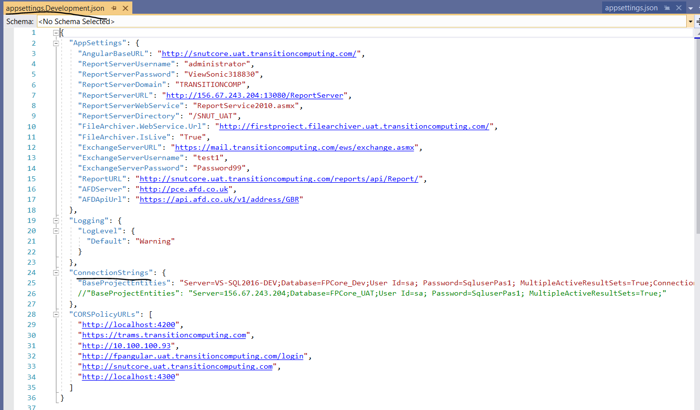
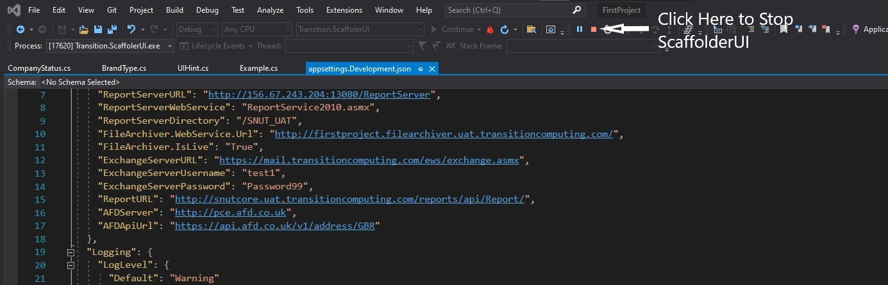
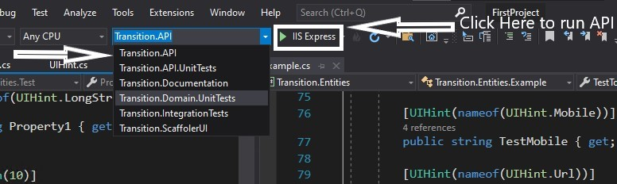
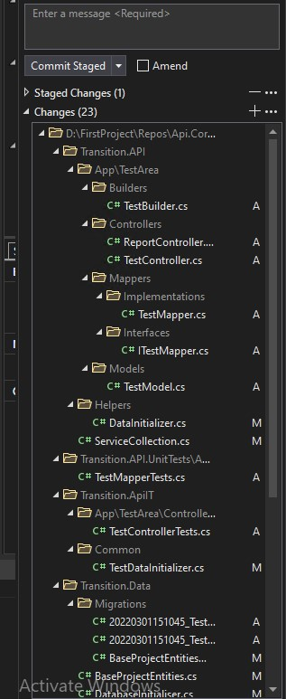
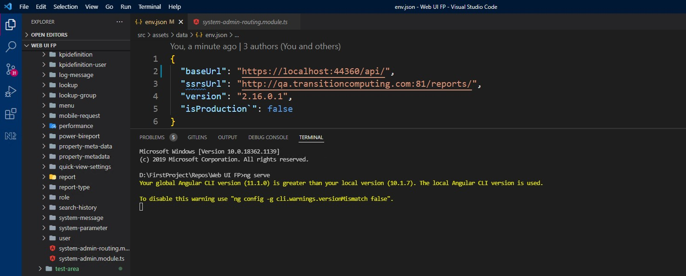
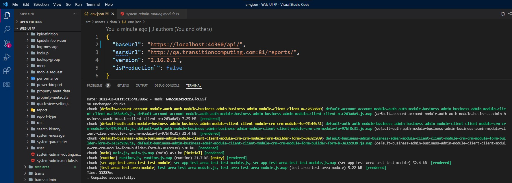
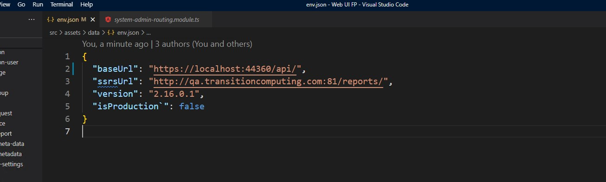
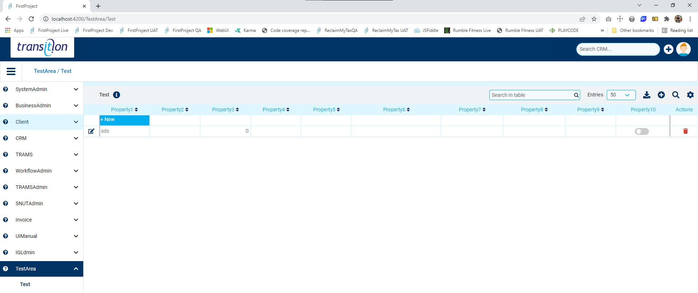
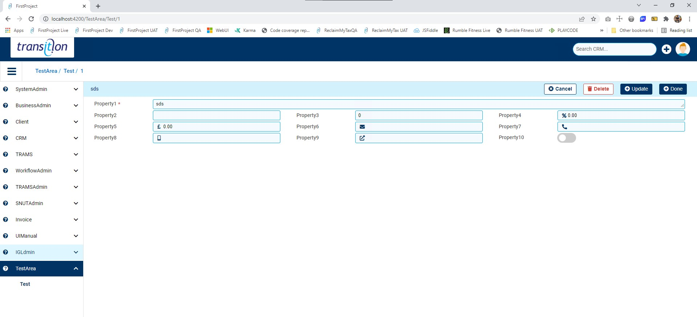

# Scaffolding First Project

## Step 1 Creating Entity Class File
---


1. Opan Api.Core Project using [visual Studio](https://visualstudio.microsoft.com/downloads/ 'Visual Studio').  
2. Open `Solution Explorer` Then Go to `transition.Entities` > `EntityClass` \


3. Create Your Entity Class File Inside Area Folder. eg:- in above Image `Example.cs` is Entity class File. and `UIManual` Is Area Name.
    - Click [here](#entity-class) to learn, How to Creact Entity Class File.

4. After Creating Entity Class File. Then Build `transition.ScaffolderUI` & `transition.Enitiy` . \


5. If you Want to Change the Database name then Open `appsettings.Development.json` file Then Make changes in the ConnectionString. \


## &nbsp;

## Step 2 Run The Scaffolder 
---
6. After Building Project Run `transition.ScaffolderUI` &  \


7. After Succesfully Run. It show Scaffolder UI As Shown in below.\


8. In Scaffolder UI 1st We have to select WebUI project Folder.
9. Now In `Select Area` Section You can able to see the Area name Which We created in Point 4. When We select Area name then inside `select Entities` we can able to see the Entity names which we created. 


10. After Selecting Area name and Entity. Select the functionality.
    * `Scaffold UI` - Check if you want to scaffold ui.
    * `Scaffold API` - Check if you want to scaffold API.
    * `Run migration` - check if you are scaffolding for 1st time or added/removed column form entity class file. it will create table or add/update column or relations into database.
    * `Select Parent` - If you are scaffolding Child Entity then you can select parent for that entity.
    * `Scafold Child` - If you want child also get scafolded. while scafolding some parent entity then check this.


11. After Selecting functionalities. press Scaffold button and wait until it get completed.

12. After scaffolding gets completed,stop the `transition.scaffolderUI` and then build `transition. API`  and run it in a similar way as we had built & run `transition.ScaffolderUI`




13. While `Transition.API` is runing. open WebUI Project on [visual studio code](https://code.visualstudio.com/ "visual studio code") (recommended)

14.  Make sure that changes have been done after scaffolding **as per below:** \
     - Check It Should Create Json with name of Your Entity class file On UI. And Other Files also created on UI Like show in below's ScreenShort\
    
    
     - Check It Should Create Json with name of Your Entity class file On API. And Other Files also created on API Like show in below's ScreenShort\
    
15. Run the Project on terminal using `ng serve` command.
     - ng serve Start
    
     - When Ng Serve Get Complete
    


16. In WebUI open `env.json` file and make sure baseURL is pointing to `https://localhost:44360/api`


17. After Running Api and WebUI Successfully. open browser and test check the changes on `https://localhost:4200`. 



>## NOTE
> If You face any error during in above process. Please contact to Developer


## &nbsp;
## &nbsp;
## &nbsp;
## Entity Class
---

To Create Entity class file, Open `Solution Explorer` Then Go to `transition.Entities` > `EntityClass` \


in Above Screen, Folder under EntityClasses Folder Is known as Area Name.\
if you want create new Area then create New Folder under EntityClasses.\
inside that Area Folder create Entity class file as `EntityName.cs`.
#### &nbsp;
## Step To wite Entity Class file

```c#
namespace Transition.Entities
{
    using System;
    using System.Collections.Generic;
    using System.ComponentModel.DataAnnotations;
    using System.ComponentModel.DataAnnotations.Schema;
    using System.Linq;
    using Transition.Entities.Enums.Lookups;

    /// <summary>
    /// Example.
    /// </summary>
    public partial class Example : BaseEntity
    {
        [Required]
        [UIHint(nameof(UIHint.LongString))]
        public string TestString { get; set; }
    }
}
```
Above code is tha basic structure of entity class file. which has string Property With Uihint of LongString.

So, As Per our Requirement we have to add property fields which we have to use.

Type For Property fields will differentiate with the Help of UIHint eg:


| Property Field Type| | Corresponding UI Hint |
| ---- | ----| ----|
| Text Input | |  ShortString |
| Text Area Box | | LongString |
| number Input | | Int |
| Date Input | | DateTime / Date |
| toggle check box | | CheckToggle |
| DropDown | | Dropdown |

Above are the few example of property name having UIHint.

we have Many more type of UIHint which you can see in `UIHint.cs` file. which  is located at 
> `transition.Entities` > `Enums` > `Lookups` > `UIHint.cs`

If You Want to make property Field to Required. then Only write ` [Required]` above the UIHint as shown in code otherwise no need to write ` [Required]`.

>## NOTE
> We have `Example.cs` Where We have Use Example Of All controls We have.
> You can find `Example.cs` at
>
>   `transition.Entities` > `EntityClasses` > `UIManual` > `Example.cs` 

#### &nbsp;
## Step To Create Lookup file

If You wanted to add Lookup Then you have to create Lookup File at 

 > `transition.Entities` > `Enums` > `Lookups` 

 Create a new File Under Lookups eg-  `TestLookup.cs`

 `TestLookup.cs`
 ```C#
//-----------------------------------------------------------------------
// <copyright file="CompanyStatus.cs" company="Transition Computing">
// Copyright (c) Transition Computing. All rights reserved.
// </copyright>
//-----------------------------------------------------------------------
namespace Transition.Entities.Enums.Lookups
{
    [ItemsCanBeAddedOrRemoved]
    public enum TestLookup
    {
        Test0 = 0,
        Test1 = 1,
        Test2 = 2,
        Test3 = 3,
    }
}
 ```

Above Are the Example Of How to write Lookup File.
